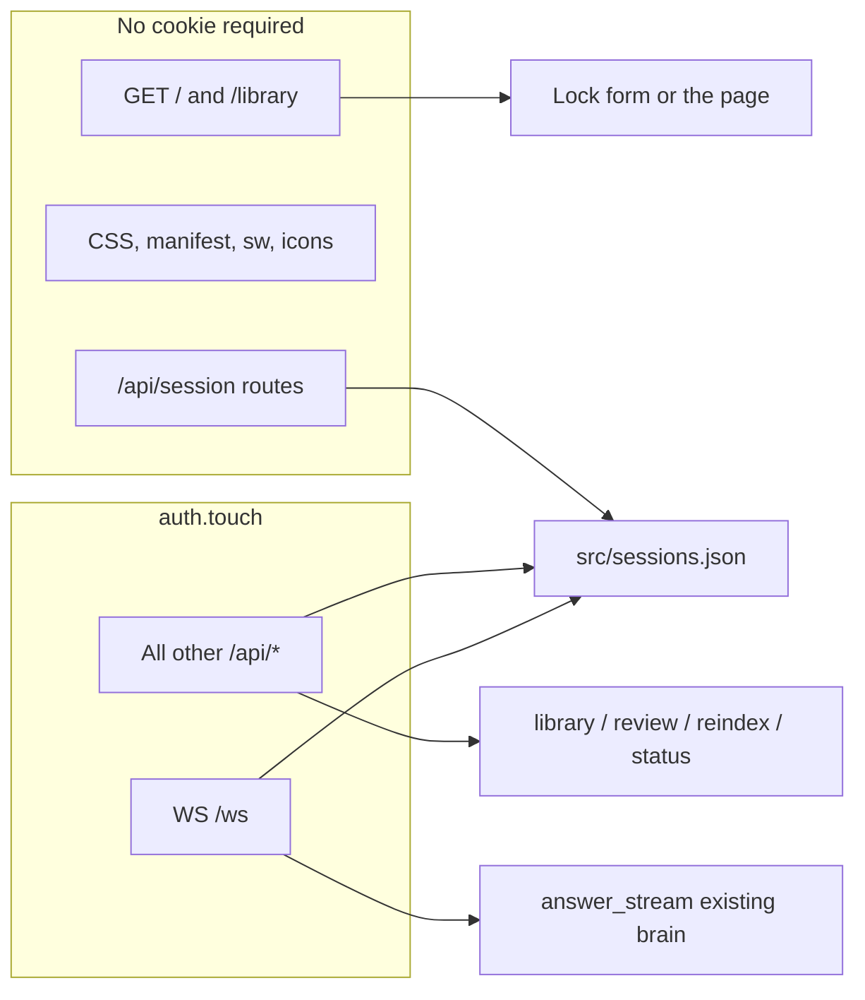
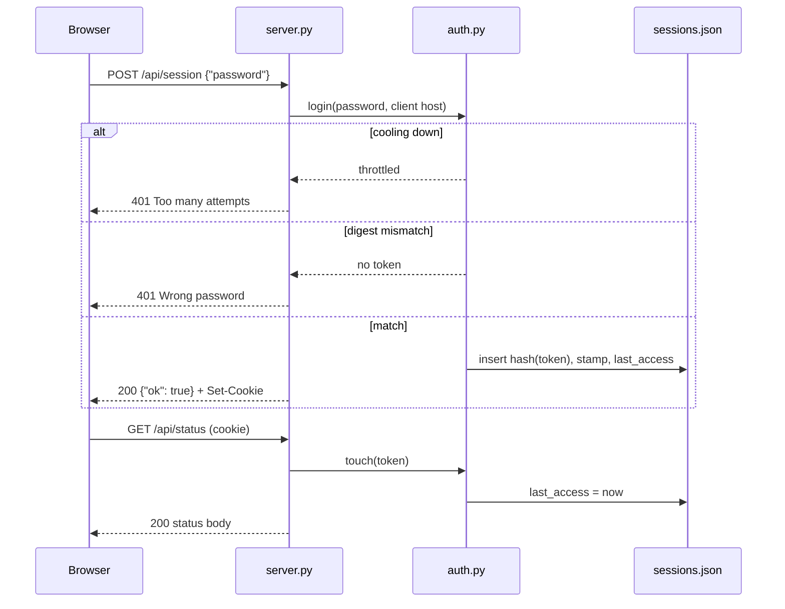

# Master lock

| | |
|---|---|
| Date | 2026-09-26 |
| Status | Approved |
| Spec | `docs/superpowers/specs/2026-09-26-master-lock-design.md` |

Ask Northwind on `HOST=0.0.0.0` is the whole website: Ask, the WebSocket, Library upload, Approve, and Re-index. Nothing in front of it checks a password. This design puts one shared master password on the website only. A correct password issues an opaque cookie. The server stores a hash of that token and drops it 10 days after it was last used, or immediately on logout. Logout and the idle boundary cancel in-flight generation and close every already-accepted socket for that token with `1008`, without waiting for another client frame. A password change does not send `1008` from the new process. Restarting exits the old process, which drops its sockets (the browser sees the connection die, typically `1006`). The new process only purges rows whose stamp does not match. There are no sockets yet to close.

There is still no account system. `cli.py`, `retrieve.py`, `eval.py`, `build_index.py`, and `chunk.py` stay unlocked. Approve stays the human gate for the corpus. The lock only decides whether a browser may call the website.

## Background and motivation

`server.py` binds `HOST` and `PORT` from the environment (`_listen_address()`). Unset, that is `127.0.0.1:8000`. `HOST=0.0.0.0` accepts every machine on the LAN. `src/README.md`, `src/LEARNING.md`, and `AGENTS.md` all say the same thing: there is no login, so anyone who can open the port can ask questions and can approve, delete, and re-index.

That was an explicit non-goal (see `AGENTS.md` Library section, the gotchas list, and the older specs under `docs/superpowers/specs/`). It stops being acceptable once the bind address is not loopback. The corpus path may be a real notes folder. Approve writes it.

The website already has two HTML routes (`GET /`, `GET /library`), a closed static shell, and JSON APIs. The lock has to fit that shape: one new flat module, no new HTML route, no new dependency, no change to retrieval.

## Goals and non-goals

**Goals**

- One master password for every browser. Missing or empty, `python server.py` exits before Uvicorn binds.
- A successful unlock returns an `HttpOnly` cookie. The server session slides: each authenticated use sets `last_access`. Dead when `now - last_access >= 864000` seconds. No second, absolute lifetime.
- Logout deletes that one server record and immediately closes every accepted WebSocket that presented that token (`1008`, in-flight generation cancelled). A copied cookie from that browser fails afterward, including a socket that sends no further frame. A different browser that unlocked on its own has a different token and stays in, socket included. The same close runs when the idle boundary is reached, without waiting for a client frame.
- Restart keeps sessions. Password change plus restart kills all of them.
- Every useful website action requires the cookie. The HTML shell and the three session routes do not.
- Wrong passwords slow down after a short in-memory cool-down. Failures are a generic 401. The password and the token are never logged.
- Ask’s `sessionStorage` thread (`ask-northwind-chat`) is unchanged. A dead session shows the lock again, on both pages, including when the socket closes because the session is gone.
- Unauthenticated callers get 401, never the rebuild 409.
- Verification is a throwaway `TestClient` script. No pytest.

**Non-goals**

- Usernames, signup, roles, OAuth, per-user accounts, password reset.
- An “auth off” mode, including “empty `LOCK_PASSWORD` means open.”
- Locking the CLI or `eval.py`. Changing `retrieve()`, chunking, prompts, or eval thresholds.
- A third HTML page, a JS router, CSRF tokens, `Secure` cookies, query-string tokens, Redis, Pydantic, LangChain, new packages.
- Replacing Approve. Unlocking does not write `DOCS_DIR`. Approving does not check the password a second time.
- Multi-process session locking, metrics, or a feature flag.
- Rewriting older specs in `docs/superpowers/specs/`. They stay historical. `AGENTS.md`, `src/README.md`, and `src/LEARNING.md` are the docs that change. The tracked filename is `AGENTS.md`, not `Agents.md`.

## Key decisions

| Decision | Choice | Why |
|---|---|---|
| Env var | `LOCK_PASSWORD` | Same `.env` / shell-wins pattern as `HOST`. One name, required, never committed. |
| Module | `src/auth.py`, stdlib only | Flat module, `from auth import …`. FastAPI stays in `server.py`. |
| Startup | `require_lock_password()` in `main()` and again in lifespan | Exits before `uvicorn.run`. `uvicorn server:app` cannot skip it. Not checked at import, so `import server` still works. |
| Error string | `LOCK_PASSWORD is missing or empty. Set it in .env (see .env.example). The website does not start without a password.` | Same kind of `SystemExit` text as a bad `PORT`. |
| Session file | `src/sessions.json` | Gitignored. One small JSON file. Survives restart. Not `index/` and not `DOCS_DIR`. |
| Record key | SHA-256 hex of the raw token | A stolen file is not a bag of cookies. |
| Record fields | `stamp`, `created_at`, `last_access` (unix seconds) | Stamp binds the row to the current password. `created_at` is not an expiry. |
| Idle rule | `SESSION_IDLE_SECONDS = 10 * 24 * 60 * 60` (`864000`). Dead when `now - last_access >= SESSION_IDLE_SECONDS` | Matches the product rule, including the equal boundary. Whole seconds via `int(time.time())`. |
| Cookie | Name `northwind_session`. `HttpOnly`, `SameSite=lax`, `Path=/`, `Max-Age=864000`, refreshed on authenticated HTTP responses. No `Secure`. No `Domain`. | Opaque 256-bit token. Lax is the CSRF control. The app is HTTP on localhost and LAN, so `Secure` would hide the cookie from the browser. |
| Token | `secrets.token_urlsafe(32)` (32 bytes from `secrets`, 256 bits) | Cookie value only. Never a query parameter, never a WebSocket field, never the JSON body. |
| Password check | SHA-256 both sides, then `hmac.compare_digest` on the digests | Equal length. Do not compare the raw strings. |
| Stamp | `SHA-256(b"ask-northwind-lock-v1" + utf-8 password).hexdigest()`, cached by `reload_password()` | Not the password. A different prefix than the login digest, and the login digest is not stored. Password change ⇒ different stamp ⇒ rows purged at startup. |
| Routes | `POST /api/session`, `POST /api/session/logout`, `GET /api/session` | Login, logout, status. Not new pages. Logout is POST so a top-level GET cannot clear the cookie. |
| `last_access` | Every successful `touch`: protected HTTP requests, `GET /api/session` when the cookie is live, WebSocket connect, and each inbound WebSocket message that `touch` accepts | Not the public shell. Not streamed tokens. Not a failed login. The idle sweeper calls `classify_key` on the stored hash. It must not call `touch` (that would slide the row) or `classify` (that would hash the hash and miss the row). |
| Live sockets | `server.py` registry: token hash → set of accepted sockets, each holding the one `threading.Event` for that connection. Process memory only. `note_deadline` stores `(key, last_access)` and does not keep the raw token. | Logout and a dead `touch` `set()` that event inside `drop_sockets` and do not `clear()` it. The question branch `clear()`s it only after `touch` is `"ok"` and the socket is still registered, immediately before `pump_task = asyncio.create_task(run())`. `run` awaits `_pump`. The receive loop does not. The sweeper `clear()`s its wake after every wait. A restart drops the sockets because the process exits. Not written to `sessions.json`. |
| Throttle | 5 failures per client host, then refuse for 60 seconds. In memory. `time.monotonic`. | Small, resets on restart, no Redis. |
| UI | `class="locked"` on `<body>` in both existing pages. Shared rules in `app.css`. No new route. | First paint hides Ask and Library actions. JS removes `locked` only after `GET /api/session` is 200. |
| Dead socket | Handshake denial `401` before accept. After accept, `close(1008)` as soon as that token is dead, without waiting for another client frame. Ask treats `1008` and a following session 401 as the lock, not as a crash and not as “Ready”. | `SameSite` cookie is the WebSocket credential. Only sockets that were registered are closed. |
| Cache | `ask-northwind-v10` | Shell HTML and CSS change. Still never cache `/ws` or `/api/*`. |
| CSRF | `SameSite=lax` only | Required. No CSRF token. |

## Proposed design



`auth.py` owns the password, the throttle, and the session file. `server.py` owns HTTP and the socket. Neither retrieves or prompts. `retrieve.py` does not learn about cookies.

### `src/auth.py`

Module docstring (why, not a tour of the functions):

```python
"""
One shared website password, and a session per browser.

A single boolean cookie would log every browser out together and could
not be revoked while a copy of it still exists. Keeping sessions only in
process memory would drop the idle window on restart. Comparing the
password with == leaks timing, and storing it next to the token would
put the secret in a file we already have to keep on disk.

Sessions are random tokens. The file stores a hash of the token and a
stamp of the current password, and a logout deletes that one record.
"""
```

Import style matches the repo: `from __future__ import annotations`, dataclasses, `Path(__file__).parent`. The module calls `load_dotenv(Path(__file__).parent / ".env")` with the default `override=False`, same as `llm.py`, `chunk.py`, and `server.py`. A shell export wins. CLI scripts must not import this module.

`__main__` loads the env (the import already did), calls `require_lock_password()`, and prints `LOCK_PASSWORD is set.` It does not print the password, the stamp, or start Uvicorn.

Constants:

```python
COOKIE_NAME = "northwind_session"
SESSION_IDLE_SECONDS = 10 * 24 * 60 * 60  # 864000
LOGIN_MAX_FAILURES = 5
LOGIN_COOLDOWN_SECONDS = 60
MAX_SESSIONS = 100
STAMP_PREFIX = b"ask-northwind-lock-v1"
SESSIONS_PATH = Path(__file__).parent / "sessions.json"
```

`SESSIONS_PATH` is a module global. Production does not read another env var for it. The throwaway script rebinds `auth.SESSIONS_PATH` to a temp file before any call that reads or writes sessions. There is no `SESSIONS_PATH` environment variable.

Public functions the server uses:

| Function | Behavior |
|---|---|
| `require_lock_password() -> str` | `password = (os.environ.get("LOCK_PASSWORD") or "").strip()`. Empty result → `SystemExit` with the string in Key Decisions. No `KeyError` when the variable is unset. Does not re-read `.env`. |
| `passwords_match(supplied: str, expected: str) -> bool` | SHA-256 digest of each UTF-8 string, then `hmac.compare_digest`. |
| `password_stamp(password: str) -> str` | Hex SHA-256 of `STAMP_PREFIX + password.encode("utf-8")`. |
| `reload_password() -> list[str]` | Calls `require_lock_password()`, caches that stripped password and `password_stamp` of it as one pair, drops rows whose stamp does not match or whose idle window has elapsed, atomic-writes if anything was dropped, returns the dropped token hashes. |
| `login(password: str, client_key: str, now: int \| None = None) -> LoginResult` | Throttle, then compare against the cached password only, then insert with the cached stamp. Does not read `os.environ`. |
| `logout(token: str) -> LogoutResult` | `removed`, `absent`, or `store_error`. Does not clear a cookie; `server.py` does that. |
| `touch(token: str, now: int \| None = None) -> TouchResult` | Validate and slide. `ok`, `dead`, or `store_error`. |
| `classify(token: str, now: int \| None = None) -> TouchResult` | `classify_key(token_key(token), now)`. Hashes the raw cookie once. Do not pass a registry key here. |
| `classify_key(key: str, now: int \| None = None) -> TouchResult` | Looks up `key` in the session file as already stored. Does not hash again. Same three states as `classify`, and a live row is not rewritten. The idle sweeper uses this, never `touch` and never `classify`. |
| `is_public(method: str, path: str) -> bool` | Allowlist below. |
| `reset_throttle() -> None` | Clears the in-memory failure map. For the throwaway script and for tests of `login`. Not a route. |
| `token_key(token: str) -> str` | SHA-256 hex of the raw cookie. Registry key and session-file key. |

`LoginResult` is a dataclass: `token: str | None`, `throttled: bool`, `store_error: bool`, `evicted_keys: list[str]`. Exactly one of “token set”, “throttled”, “store_error”, or all three false (wrong password). `evicted_keys` is only set when a token was issued. Never put the password on it.

`TouchResult` is a dataclass: `state: str` (`"ok"`, `"dead"`, or `"store_error"`) and `last_access: int | None` (set on `"ok"`). `LogoutResult` is a dataclass: `state: str` (`"removed"`, `"absent"`, or `"store_error"`).

`reload_password()` stores the stripped password and the stamp in module globals and replaces both together. `login` compares with `passwords_match(supplied, cached_password)` and writes `cached_stamp` onto the new row. It does not call `require_lock_password()` and it does not read `LOCK_PASSWORD`. A request-path re-read that updated only one of the two would mint a row `touch` rejects. Tests that change the env var call `reload_password()` before the next `login`, so the pair moves together before any row is written. If `login` runs before the first `reload_password()`, return `store_error` and do not write a row. Lifespan calls `reload_password()` before accept, so production requests see a pair.

`now` defaults to `int(time.time())`. HTTP routes do not take a time from the client. The optional argument is for direct calls. Throttle deadlines use `time.monotonic()` inside `login`, not `now`, so a wall-clock step does not shorten or stretch the cool-down. Tests that must not sleep pass `mono: float | None = None` as well; default `time.monotonic()`.

One `threading.Lock` wraps every load/modify/save of the session file and the throttle map. Hold it only around that work, never around retrieval or the LLM. File IO stays on that lock. `server.py` calls these functions through `asyncio.to_thread` from async middleware and the WebSocket handler so the event loop is not blocked on the disk. Sync `def` routes already run in FastAPI’s threadpool; they may call `touch` directly. Prefer one rule: all server callers use `await asyncio.to_thread(...)`.

### Startup

`require_lock_password()` is not called at import.

`server.main()` order, all before `uvicorn.run`:

1. `require_lock_password()`
2. `_require_index()` (unchanged)
3. `_listen_address()` (unchanged)
4. import uvicorn, then `uvicorn.run(app, host=host, port=port)`

A missing password is reported even when the index is also missing. A bad `PORT` still never binds. Do not catch `SystemExit`.

Lifespan, before `_require_index()` and `_load()`:

```python
require_lock_password()
await asyncio.to_thread(reload_password)
```

`reload_password()` is what makes a restart with a new password drop every old row before the first request. `main()` does not need to purge; lifespan runs inside `uvicorn.run` before the socket accepts, which on this Uvicorn is before `create_server`. Supported entry remains `python server.py`. The lifespan check covers `uvicorn server:app`. The hashes it returns are file keys whose rows were just deleted. Lifespan runs before any socket exists. The new process must not call `drop_sockets` and must not send `1008`. The old process already exited, and that exit is what drops its sockets. A later `reload_password()` inside a process that still has registered sockets (the throwaway script changing the password without exiting) does call `drop_sockets` on each returned hash. That is not startup.

The configured password is the stripped env value. Internal spaces stay. The submitted password is not stripped. `python-dotenv` quote handling is unchanged.

Do not run Uvicorn with extra worker processes. The lock and the throttle are in-process. The default `uvicorn.run(app, host=host, port=port)` is one process. Leave it that way.

### Password compare and stamp

```python
def passwords_match(supplied: str, expected: str) -> bool:
    left = hashlib.sha256(supplied.encode("utf-8")).digest()
    right = hashlib.sha256(expected.encode("utf-8")).digest()
    return hmac.compare_digest(left, right)

def password_stamp(password: str) -> str:
    return hashlib.sha256(STAMP_PREFIX + password.encode("utf-8")).hexdigest()
```

Both digests are 32 bytes, so `compare_digest` does not take the short-circuit that unequal string lengths take. The stamp uses a prefix so it is not the same hex as the login digest. Only the stamp is written to disk. Cache it on `reload_password()`. Later requests compare stored stamps with `hmac.compare_digest`, not `==`. A stored stamp whose length is wrong compares false and the row is dropped.

`reload_password()` after a password edit is how the process notices. Nothing watches `.env` in a running process. Changing the password requires a restart. That restart is what the product asked for.

### Session file

Path: `src/sessions.json`. Add both lines to `.gitignore` (the temp name is the live name plus `.tmp`, same idea as `library.write_doc`):

```
src/sessions.json
src/sessions.json.tmp
```

Shape:

```json
{
  "sessions": {
    "<sha256 hex of the raw cookie>": {
      "stamp": "<password stamp hex>",
      "created_at": 1758844800,
      "last_access": 1758844900
    }
  }
}
```

`created_at` and `last_access` are int unix seconds. The key is `hashlib.sha256(token.encode("utf-8")).hexdigest()`, not the token. Missing file means zero sessions. A row missing a field, or with a non-int time, is dropped. Unknown extra JSON keys are ignored.

Corrupt JSON or a top-level value that is not an object: do not delete the file in place. Behave as zero sessions, and print one stderr line: `sessions.json could not be read; treating it as no sessions.` The next successful login atomic-replaces the file. Do not print the exception text (a JSON error can quote file bytes). Do not print a token, stamp, or password.

Atomic save, same spirit as `build_index.py` (write the finished bytes, then replace) and the same mechanism as `library.write_doc`:

```python
def _save(payload: dict) -> None:
    path = SESSIONS_PATH
    path.parent.mkdir(parents=True, exist_ok=True)
    tmp = path.with_name(path.name + ".tmp")
    data = json.dumps(payload, indent=2, sort_keys=True).encode("utf-8")
    tmp.write_bytes(data)
    tmp.replace(path)
```

`Path.replace` is the rename. A crash before `replace` leaves the previous `sessions.json` in place. No `fsync` (the corpus writer does not fsync either). One process, so no cross-process lock.

On every load used for a decision, drop expired rows and rows whose stamp does not match the cached stamp, then save if the set changed. `touch`, `classify`, and `classify_key` that find the row expired or stamped wrong also remove it. That removal is a save. If the save fails, the result is `store_error` and the previous file, row included, is still the live one. `classify_key` looks the key up directly. `classify` hashes first, then calls `classify_key`.

`MAX_SESSIONS = 100`. A login that would exceed 100 drops the rows with the oldest `last_access` until there is room, then inserts. A hundred browsers is past any real use of this demo; the cap only stops a runaway file. `LoginResult.evicted_keys` lists those token hashes. The login route calls `drop_sockets` on each so an evicted browser’s open socket does not keep streaming. Do not evict the row just inserted, and do not evict the row `touch` is refreshing. Evicted cookies fail their next HTTP call with 401.

Disk-full and other `OSError` on save leave the previous file in place (`replace` did not happen). Stderr gets one fixed line, `session store could not be written.` It does not include the path, the token, the stamp, or the password. Callers must not treat that as “the row is gone”:

- `login`: no cookie, HTTP 500 `Could not store the session.`
- `logout`: `store_error`. The route returns that same 500 and does not clear the cookie. The row is still a live session. Do not `drop_sockets`.
- `touch` / `classify` / `classify_key`: if the row was otherwise live and the slide or the idle-delete could not be written, `store_error`. HTTP 500 with the same detail when the caller is HTTP. Do not clear the cookie. Do not `drop_sockets`. The sweeper leaves those sockets up and retries that key in 60 seconds.
- `store_error` is not `dead`. Clear the cookie only when the token is not a live session (`dead`, `removed`, or `absent`).

### Login, logout, touch



**Login** (`POST /api/session`).

Body is JSON `{"password": "<string>"}`. Non-JSON, or a JSON value that is not an object, or a `password` that is not a string: 400 `Expected JSON body.` Same copy as `api_save_draft`. That 400 does not increment the throttle (the client is broken, it is not a guess).

A string password, including `""`, is an attempt. Throttle first (see below). If the client is cooling down, do not call `passwords_match`, do not write the file, return 401 `Too many attempts. Try again shortly.` If the digest does not match, increment that client’s failure count and return 401 `Wrong password.` Both 401 bodies are FastAPI’s normal `{"detail": "..."}`. Do not vary them to describe which check failed beyond those two strings. Do not echo the password.

On match: clear that client’s throttle state, create `secrets.token_urlsafe(32)`, set `created_at` and `last_access` to now, set `stamp` to the cached stamp, write the file, then set the cookie. Write first, cookie second. The expected password is the cached stripped value from `reload_password()`, not a fresh `os.environ` read.

A new login does not revoke earlier tokens. It does not delete the row for the cookie this request presented, and it does not delete other browsers’ rows. The browser will overwrite its own cookie jar; the previous token stays in the file. A stolen copy of that previous cookie remains valid until that token is logged out, the idle boundary, `MAX_SESSIONS` eviction, or a password change plus restart. Logout of the new cookie does not kill the old one. Do not adopt a caller-supplied token. Login always mints a new one with `secrets`. A second `TestClient` that logged in on its own is a second token.

Success body is exactly `{"ok": true}`. The token is not in the JSON.

**Logout** (`POST /api/session/logout`).

No body. Public. Logout does not touch the throttle and does not delete `ask-northwind-chat`.

- `removed`: the row was deleted and the file was replaced. 200 `{"ok": true}`, clear the cookie, then `await drop_sockets(token_key)`. That closes every accepted socket for this token with `1008` and cancels its in-flight generation. Do not wait for a client frame.
- `absent`: there was no row (missing, already expired, unknown). 200 `{"ok": true}`, clear the cookie, and still `drop_sockets` in case the registry has a socket whose row is already gone.
- `store_error`: the row could not be removed. 500 `{"detail": "Could not store the session."}`. Do not clear the cookie. Do not `drop_sockets`. A copy of the cookie still works, which is the point of not pretending the logout happened.

Other tokens are not in this key. Logging out one browser does not log out a browser that unlocked separately.

**Status** (`GET /api/session`).

Public at the middleware, so a missing cookie can be answered by the route. Call `touch`. `"ok"` → 200 `{"ok": true}` and the cookie refresh (the route sets it, because this path is public and the middleware does not). `"dead"` → 401 `Unauthorized.`, clear the cookie, and `drop_sockets` for that token key. `"store_error"` → 500 `Could not store the session.`, cookie left in place, sockets left up. This route does not read the corpus, the index, or the review queue. It is how both pages decide whether to show the lock. It does not return `last_access`, the stamp, or the token.

**Touch and classify.**

`touch` returns `"dead"`, and the row is removed when it was present, when any of these hold: empty token, unknown hash, stamp mismatch, or `now - last_access >= SESSION_IDLE_SECONDS`. Equal to 864000 is dead. 863999 is still live, and that call sets `last_access` to now, which is what “sliding extends life” means.

`"ok"` updates `last_access` to now and saves. `created_at` stays. A use that then returns 409 or 400 from the route still counts: the middleware touches before the handler. `"store_error"` means the row was live (or the delete of a dead row did not land). Do not map it to 401.

`classify_key(key, now)` uses the same dead rules and the same removal, but the argument is the session-file key already. It does not call `token_key`. A live row returns `"ok"` and the stored `last_access` without writing. `classify(token, now)` is only `classify_key(token_key(token), now)`. Passing a registry hash to `classify` hashes it again, misses the row, and returns `"dead"` while the row is still live. The idle sweeper calls `classify_key`. It must not call `touch` (every wake would slide the row and the boundary would never fire) and it must not call `classify`.

What counts as a use (a `touch`, not a `classify` or `classify_key`):

- Any non-public HTTP request whose `touch` is `"ok"`, including `GET /api/status`, reads, uploads, review mutations, and `POST /api/reindex`.
- `GET /api/session` when the cookie is live.
- WebSocket: once, before `accept`, and again as the first action after each successful `receive`, before any other branch. Only an `"ok"` result slides. The message is then handled. A `"dead"` result does not slide.

What does not:

- `GET /`, `/library`, `/app.css`, the manifest, the service worker, icons.
- `POST /api/session` and logout (login inserts a fresh `last_access`; it does not slide an old token).
- Outbound WebSocket events (`token`, `sources`, `status`, `done`). A long answer does not rewrite the file per token.
- The idle sweeper.
- A message whose `touch` is `"dead"` or `"store_error"`.

Always persist on a successful `touch`. The busiest writers are the rebuild polls of `GET /api/status` once a second, on Ask and on Library, and only while that page is unlocked and a rebuild is running. The file is a few kilobytes (100 sessions is on the order of 20 KB). That is acceptable. No write debounce, so a test can set `last_access` and see the slide after one call.

### Throttle

Per client host, in memory, lost on restart. Key is `request.client.host` stripped, or `"unknown"` when `request.client` is missing. Do not read `X-Forwarded-For`. There is no proxy in front of this app, and that header is spoofable. One NAT shares one bucket. That is the whole LAN in the usual setup.

State per key: `failures: int`, `locked_until: float` (a `time.monotonic()` deadline).

- If `mono < locked_until`: return throttled. Do not compare the password. Do not add to `failures`.
- If `mono >= locked_until` and `locked_until != 0`: set `failures = 0` and `locked_until = 0` first, then evaluate this attempt. The cool-down ending gives five fresh tries.
- Wrong password: `failures += 1`. When `failures >= LOGIN_MAX_FAILURES` (5), set `locked_until = mono + LOGIN_COOLDOWN_SECONDS` (60). The fifth failure itself is still `Wrong password.` The next attempt inside the window is `Too many attempts. Try again shortly.`
- Right password: set `failures = 0` and `locked_until = 0`, then issue the session.
- `reset_throttle()` clears every key.

Sustained online rate after the first five misses is about five guesses per minute per host. That is a speed bump, not a lockout policy. The operator’s real defense is a long passphrase in `.env`. The server does not enforce a minimum length beyond non-empty, because empty is the only invalid configuration this spec adds.

`TestClient` reports the host as `testclient`, so every request in one process shares a bucket. The throwaway script calls `reset_throttle()` between sections, or it will lock itself out. The throttle case is last, or it resets before the next login.

### HTTP gate

Starlette’s `@app.middleware("http")` does not run for WebSockets. HTTP uses middleware so a new route cannot forget the check. Do not raise `HTTPException` inside that middleware (`BaseHTTPMiddleware` can turn it into a 500). Return `JSONResponse({"detail": "Unauthorized."}, status_code=401)`.

```python
@app.middleware("http")
async def lock_middleware(request: Request, call_next):
    if is_public(request.method, request.url.path):
        return await call_next(request)
    token = request.cookies.get(COOKIE_NAME, "")
    result = await asyncio.to_thread(touch, token)
    if result.state == "store_error":
        return JSONResponse(
            {"detail": "Could not store the session."}, status_code=500
        )
    if result.state != "ok":
        await drop_sockets(token_key(token))
        response = JSONResponse({"detail": "Unauthorized."}, status_code=401)
        if token:
            _clear_session_cookie(response)
        return response
    note_deadline(token_key(token), result.last_access)
    response = await call_next(request)
    _set_session_cookie(response, token)
    return response
```

The middleware does not read the body. Auth runs before `_unlocked()` and before `api_reindex` looks at `_rebuilding`. An unauthenticated `POST /api/reindex` is 401 even when `_rebuilding` is already true. An authenticated caller still gets today’s 409 `Index is rebuilding. Try again when it finishes.` Same for upload, delete, and review mutations. `GET /api/docs`, `GET /api/review`, and `GET /api/status` stay allowed during a rebuild, but only after the cookie passes.

`is_public`:

| Method | Path |
|---|---|
| GET | `/`, `/library`, `/app.css`, `/manifest.webmanifest`, `/sw.js`, `/api/session` |
| GET | `/icons/…` when the path starts with `/icons/` and does not contain `..` |
| POST | `/api/session`, `/api/session/logout` |

Anything else is protected, including `GET /api/status`, `GET /api/docs`, `GET /api/docs/{name}`, `POST /api/docs`, `DELETE /api/docs/{name}`, `GET /api/review`, `PUT /api/review/{name}`, `POST /api/review/{name}/format`, `POST /api/review/{name}/approve`, `DELETE /api/review/{name}`, `POST /api/reindex`, and any path not listed. A logged-out request to an unknown path is 401. A logged-in request to an unknown path is still 404. Do not add `CORSMiddleware`. Other origins are not invited.

FastAPI’s default docs stay enabled: `GET /docs`, `GET /redoc`, `GET /openapi.json`, and `GET /docs/oauth2-redirect`. They are not public and they are not added to `is_public`. Logged out, the middleware returns 401 before those routes run. Logged in, the request falls through, so `GET /docs` is 200 (Swagger’s HTML), not 404. Do not turn docs off, and do not treat “absent from the route table in this spec” as “return 404.”

Cookie helpers live in `server.py` so `auth.py` stays stdlib. They use `auth.COOKIE_NAME` and `auth.SESSION_IDLE_SECONDS`.

```python
def _set_session_cookie(response: Response, token: str) -> None:
    response.set_cookie(
        key=COOKIE_NAME,
        value=token,
        max_age=SESSION_IDLE_SECONDS,
        httponly=True,
        samesite="lax",
        path="/",
    )

def _clear_session_cookie(response: Response) -> None:
    response.delete_cookie(COOKIE_NAME, path="/", samesite="lax")
```

Do not pass `secure`. Do not pass `domain`. Starlette’s default is a host-only cookie, which is what we want. Refreshing `Max-Age` on each authenticated HTTP response is what makes the browser expiry slide with use. A session cookie (no `Max-Age`) would die when the browser quits and would waste the on-disk window. Logout’s delete uses the same path and `SameSite` so the browser actually drops it, and it does not set `Secure` either.

`GET /api/session` is public, so the route itself calls `_set_session_cookie` on `"ok"` and `_clear_session_cookie` only on `"dead"`. `"store_error"` sets neither. Login’s 401 does not clear a cookie that was already valid (a mistype must not log out a browser that still holds a good session). Login’s success sets the new cookie only, and `drop_sockets` on `evicted_keys` only.

### WebSocket

Cookie on the handshake, not a field in `{ "question", "history" }`. Reject before `accept`, using Starlette’s denial response. This Uvicorn build advertises `websocket.http.response`. `TestClient.websocket_connect` does not itself raise: it returns a `WebSocketTestSession`. `WebSocketDenialResponse` is raised from `WebSocketTestSession.__enter__`. A bare `client.websocket_connect("/ws")` without `with` never sees the denial. Closing with `websocket.close` before accept is a different code path; do not use it for the unauthenticated handshake.

```python
@app.websocket("/ws")
async def ws_ask(websocket: WebSocket) -> None:
    global _active_answers
    token = websocket.cookies.get(COOKIE_NAME, "")
    result = await asyncio.to_thread(touch, token)
    if result.state == "store_error":
        await websocket.send_denial_response(Response(status_code=500))
        return
    if result.state != "ok":
        await websocket.send_denial_response(Response(status_code=401))
        return
    await websocket.accept()
    send_lock = asyncio.Lock()
    cancel = threading.Event()  # one event for this connection; do not rebind
    pump_task: asyncio.Task | None = None
    background: set[asyncio.Task] = set()
    register(token_key(token), websocket, cancel)
    note_deadline(token_key(token), result.last_access)

    async def send(payload: dict) -> None:
        async with send_lock:
            await websocket.send_json(payload)

    try:
        while True:
            raw = await websocket.receive_json()
            result = await asyncio.to_thread(touch, token)
            if result.state == "store_error":
                continue
            if result.state != "ok":
                cancel.set()  # do not clear()
                await drop_sockets(token_key(token))
                return
            note_deadline(token_key(token), result.last_access)
            if not isinstance(raw, dict):
                await send(
                    {
                        "type": "error",
                        "message": "Ask a question about Northwind documents.",
                    }
                )
                continue
            if raw.get("cancel"):
                cancel.set()  # do not clear(); the in-flight worker must see it
                if pump_task is not None and not pump_task.done():
                    notice = asyncio.create_task(_notify_cancelled(pump_task, send))
                    background.add(notice)
                    notice.add_done_callback(background.discard)
                else:
                    await send({"type": "cancelled"})
                continue
            question = str(raw.get("question") or "").strip()
            if _rebuilding:
                await send(
                    {
                        "type": "error",
                        "message": "Index is rebuilding. Try again when it finishes.",
                    }
                )
                continue
            if pump_task is not None and not pump_task.done():
                await send({"type": "error", "message": "already answering"})
                continue
            if not question:
                await send(
                    {
                        "type": "error",
                        "message": "Ask a question about Northwind documents.",
                    }
                )
                continue
            if not still_registered(websocket):
                return  # drop_sockets already set(); do not clear()
            cancel.clear()  # question branch only, immediately before the task
            history = raw.get("history")

            async def run(
                question: str = question,
                history: object = history,
                turn_cancel: threading.Event = cancel,
            ) -> None:
                global _active_answers
                _active_answers += 1
                _idle().clear()
                try:
                    await _pump(websocket, question, history, turn_cancel, send_lock)
                finally:
                    _active_answers -= 1
                    if _active_answers == 0:
                        _idle().set()

            pump_task = asyncio.create_task(run())
            # back to receive_json; do not await _pump on this loop
    except WebSocketDisconnect:
        cancel.set()
        if pump_task is not None and not pump_task.done():
            pump_task.cancel()
    finally:
        unregister(websocket)
```

Do not `await _pump` on the receive loop. `run` is the only `await _pump`, and it runs on `pump_task`. The loop goes back to `receive_json`, so `{ "cancel": true }` can arrive while tokens are still sending. `api_reindex` still waits on `_idle()` before `build()`. Dropping the `_active_answers` / `_idle` wrapper would let a rebuild start under a live answer. The “already answering” branch stays: a second question while `pump_task` is not done gets that error and does not `clear()`.

`note_deadline(key, last_access)` stores that pair for the sweeper and `set()`s the sweeper’s wake event. It does not `clear()` the wake, and it does not keep the raw cookie. `key` is already `token_key(token)`. The sweeper `clear()`s the wake after it observes it, before it waits again, so `note_deadline` cannot leave the wake set across the next wait.

Today `ws_ask` creates `cancel = threading.Event()` once after `accept`, then replaces it for every question (`cancel = threading.Event()` just before `create_task(run())`, with the pump closed over `turn_cancel`). Delete that rebinding. Do not replace it with `await _pump` on the receive loop. The port must not keep both events. The one event created above is stored on `LiveSocket` and is the only one `_pump` and `drop_sockets` share. `run` passes it in as `turn_cancel`.

`answer_stream` returns immediately when `cancel.is_set()` (`generate.py`, `_cancelled`). A `threading.Event` stays set until `clear()`. The old rebinding hid that: the next question got a new event that was not set. New chat sends `{ "cancel": true }` while an answer is in flight, and the next question on that same socket must still run. So:

- The cancel-frame branch calls `cancel.set()` and does not `clear()`. The in-flight worker has to see the flag. If `pump_task` is still running it starts `_notify_cancelled` the way `ws_ask` does now. Otherwise it sends `{"type": "cancelled"}`.
- `drop_sockets` calls `cancel.set()` and does not `clear()`. Logout has popped this socket. Nothing may `clear()` that `set()` afterward. It then `close(1008)`.
- The `except WebSocketDisconnect` handler calls `cancel.set()` on it, then `pump_task.cancel()` if the task is still running. It does not `clear()`.
- The question branch is the only `clear()`. It runs after `touch` returned `"ok"`, after the non-dict, cancel, empty-question, already-answering, and rebuild branches, and only if `still_registered(websocket)` is true. `cancel.clear()` is the line immediately before `pump_task = asyncio.create_task(run())`. The next question on a live socket therefore sees `is_set() == False`. If logout already popped this socket, skip `clear()` and do not start the task. Do not `await _pump` here.

`_pump` still stops its worker when that event is set, including the `cancel.set()` it already does on `WebSocketDisconnect` inside the pump. That is the same object `drop_sockets` sets.

Denial body is empty. Status is 401 when the cookie is not a live session, 500 when the session file could not be written and the row is still live. No JSON error frame on either path. A socket that was not accepted is not registered, and `drop_sockets` does not know about it.

`touch` is the first action after a successful `receive`, before every branch that exists in `ws_ask` today:

1. non-dict (`"Ask a question about Northwind documents."`)
2. `cancel` (`{"type": "cancelled"}` or `_notify_cancelled`)
3. empty question (the same ask-a-question error)
4. already answering (`"already answering"`)
5. `_rebuilding` (`"Index is rebuilding. Try again when it finishes."`)
6. schedule `run()` with `asyncio.create_task` and return to `receive_json`. `run` awaits `_pump`. This loop does not.

A `"dead"` result sets that socket’s in-flight `cancel` event, `await drop_sockets(...)` (which `close(1008)`s this socket and every sibling that presented the same token), and returns. It does not call `send_json`. Those earlier branches must not run, or a dead session still hears `cancelled` or a generation error and Ask never takes the `1008` path. `"store_error"` does not close and does not `send_json`. The row is still live. Skip that message and wait for the next one. Do not map it onto the dead path.

`1008` means “this socket’s session is dead.” Rebuild copy stays reserved for a live session.

**Registry.** Process memory in `server.py`, not in `sessions.json` and not in `auth.py` (`auth.py` stays stdlib and does not import FastAPI):

```python
@dataclass
class LiveSocket:
    websocket: WebSocket
    cancel: threading.Event
    token_key: str

_live: dict[str, set[LiveSocket]]
```

The key is `token_key(token)`, the same SHA-256 hex as the session file. `register` after a successful `accept`, with the connection’s only `threading.Event`. `unregister` in a `finally` so a client disconnect drops the object; it is a no-op if `drop_sockets` already popped that socket. `still_registered(websocket)` is true only while that object is still in `_live`. `async def drop_sockets(key: str) -> None` pops that set only. For each `LiveSocket` it calls `cancel.set()` on the event stored at `register` (the one `_pump` is waiting on) and does not `clear()` it, then `await websocket.close(code=1008)`. Other keys are left alone. This does not wait for a client frame. It runs on the event loop (`logout` and the middleware `await` it).

`close` can race `_pump` inside `send_json`. Starlette then raises `RuntimeError: Cannot call "send" once a close message has been sent.` `drop_sockets` swallows that `RuntimeError`. It also swallows an error from a socket that is already closed. It does not swallow anything else. Setting the event is what stops `answer_stream`. Closing the socket alone does not: `_pump` only `cancel.set()`s in `except WebSocketDisconnect`, and a `send` after `close` raises `RuntimeError` instead, so the worker would keep pulling tokens into the queue. That is why the event `drop_sockets` sets must be the one the pump holds, not the event `ws_ask` used to rebind away before each question.

That cancel is only for sockets in the popped set. A handshake that was denied, or a socket that never reached `register`, is not in the set and is not described as cancelled.

A second tab in the same browser shares the cookie, so it shares the key, and logout closes both. A second browser that unlocked separately has a different token and a different key. Its sockets stay up. Its `GET /api/session` stays 200.

**Idle sweeper.** An `asyncio.Task` started in lifespan after `reload_password()`, cancelled on shutdown. Deadlines live in a dict of file key → `last_access`, filled only by `note_deadline`. No raw tokens. One `asyncio.Event`, `_wake`, is the sweeper’s wake. It is not the connection `threading.Event`.

`note_deadline` assigns the pair and calls `_wake.set()`. It does not `clear()` `_wake`. The sweeper does, after every wait returns, before it waits again. A `set()` that is never cleared makes the next `await _wake.wait()` return immediately, and connect’s `note_deadline` would busy-loop the process. `note_deadline` must not leave the wake permanently set; the `clear()` below is what keeps that true.

`async def sweep_once(now: int) -> None` copies `list(_deadlines)` before its first `await`. `classify_key` runs in `asyncio.to_thread`, and `note_deadline` may change the dict on another task while that thread is in the file lock. The loop uses the snapshot, not the live dict. Keys added during the pass are left for the next pass (their `note_deadline` has `set()` `_wake`).

- `"dead"`: delete that pair, then `await drop_sockets(key)`. The row was removed inside `classify_key` when the save succeeded. A pair left behind with `last_access` already past makes the next sleep `0` for as long as any other socket is registered.
- `"ok"`: replace the pair with the returned `last_access`. Do not close. Do not write the row.
- `"store_error"`: keep the pair. Do not close. The next wait for that key is `min(remaining, 60)` seconds, or 60 seconds when `remaining <= 0`.

The task:

```python
async def sweeper() -> None:
    while True:
        if not _deadlines and not _live:
            await _wake.wait()
            _wake.clear()
            continue
        await sweep_once(int(time.time()))
        timeout = _positive_wait()
        if timeout is None:
            await _wake.wait()
        else:
            try:
                await asyncio.wait_for(_wake.wait(), timeout)
            except asyncio.TimeoutError:
                pass
        _wake.clear()
```

`_positive_wait()` is `None` when `_deadlines` is empty and no socket is registered. The task then waits only on `_wake`. Otherwise it is the minimum positive delay in seconds. For a key whose last `sweep_once` result was `"store_error"`, the delay is `min(remaining, 60)`, and 60 when `remaining <= 0`. For every other key, `remaining = last_access + SESSION_IDLE_SECONDS - time.time()`. If `remaining <= 0`, do not append `0`. That key should already have been deleted on `"dead"`. A past key is not a zero timeout. `_positive_wait` never returns `0`.

A socket blocked in `receive_json` is closed when a pass returns `"dead"`. The browser does not have to speak. There is no second absolute lifetime.

The throwaway script does not wait 10 days and does not run this loop. It calls `sweep_once(now=...)` with an explicit unix time. Production’s `sweeper` is the only caller that passes `int(time.time())`.

Connect-time `touch` slides `last_access`. `note_deadline(token_key(token), last_access)` stores the hash and that time, and `set()`s `_wake`. It does not store the cookie. Each inbound message whose `touch` is `"ok"` does the same. A message that is `"dead"` does not.

The HTTP middleware will not refresh `Max-Age` during a socket-only stretch. `visibilitychange` calls `checkRebuildOnLoad` only when the body is not `locked` (see Pages), which hits `GET /api/status` once unlocked and refreshes the cookie. Also: `ws.onopen` fires one `GET /api/session`. If that returns 401, close the socket and show the lock. That covers the handshake/GET race and moves `Max-Age` forward when the socket connects. It is not a poll. A tab that stays visible and only streams for longer than `Max-Age`, then reloads, can show the lock even though a server row would still have been inside the idle window. That is accepted. The server rule is the one the product stated; the cookie `Max-Age` is how the browser keeps sending it across its own restarts. The sweeper, not the cookie, is what ends the open socket at the idle boundary.

### Pages

No third HTML route. `/` and `/library` remain the only documents. The lock is the logged-out state of those documents. Both files are standalone today (no shared client script). Keep it that way. A new `/lock.js` would be another public URL and is not on the allowlist. Duplicate the small script. Styles go in `app.css`, which is already public.

Both pages ship with `class="locked"` on `<body>` so the first paint does not flash the composer or the upload button. CSS:

```css
body.locked #thread,
body.locked #ask-form,
body.locked #index-note,
body.locked .lede,
body.locked #review-panel,
body.locked #library,
body.locked #logout { display: none; }
body:not(.locked) #lock { display: none; }
#lock { margin-top: 1.4rem; }
#lock-form {
  display: flex;
  flex-direction: column;
  gap: 0.55rem;
}
#lock-password { width: 100%; }
```

`#lock` is the last child of `<main>`, not the element between `.site-header` and `#review-panel`. `.site-header + .panel` in `app.css` stays Library’s review panel. `display: none` would not have saved that combinator if `#lock.panel` sat between them. `#lock` has its own `margin-top: 1.4rem`, the same gap the header rule gives the review panel. While locked, the hidden panels take no space, so the lock still paints under the header.

The lede is hidden with the actions so a locked page is the password form and the header, not a half-rendered Ask. Nav stays. Both shells are public; the other page shows its own lock. `#index-note` stays hidden until unlock. Nothing calls `GET /api/status` while `body` has `locked`, including the existing `visibilitychange` listener. That route is what leaks `stale`. `checkRebuildOnLoad` and `pollRebuild` return immediately when the body is locked. When they do fetch, they check `res.status === 401` before `setIndexNote` or any read of `body.stale`. A 401 calls `showLock("Session ended. Enter the password.")` and returns. Ask’s rebuild poll is the same one-second `GET /api/status` loop as Library’s (`startRebuildPoll` / `pollRebuild` in `index.html`). Both count toward the session-file writes above, and only while that page is unlocked.

Header, both pages, after the nav:

```html
<button type="button" class="ghost" id="logout">Log out</button>
```

Lock panel, both pages, last child of `<main>`. It is visible while `body` is `locked` (do not put `hidden` on the section):

```html
<section id="lock" class="panel">
  <h2>Locked</h2>
  <p>Enter the master password to use Ask and Library.</p>
  <form id="lock-form" method="post" action="/api/session">
    <input id="lock-password" type="password" autocomplete="current-password"
           aria-label="Password" />
    <button type="submit" id="unlock">Unlock</button>
  </form>
  <button type="button" class="ghost" id="lock-reconnect" hidden>Reconnect</button>
  <p id="lock-status"></p>
</section>
```

`#lock-reconnect` is not `#reconnect`. The one inside `#ask-form` is hidden with the form while locked, so it cannot be the offline retry. `#lock-reconnect` starts `hidden` and is shown only when `sessionOk()` throws. Its click runs `sessionOk()` again. It does not POST the password.

`method="post"` and `action="/api/session"` are the no-JS fallback so a submit cannot put the password in the query string. The script calls `preventDefault` and sends JSON. The route does not accept form-encoded bodies. The password field reuses the paper background, border, color, padding, font, radius, and brass focus of `input[type="text"]`. It does not reuse `flex: 1` (that rule is for a row the lock form does not have). The lock form is a column and the input is `width: 100%`. `#lock-status` uses the existing `.err` color when the line is a failure.

`h2` inside `.panel` is already the small uppercase label. “Locked” will look like “Review” and “Library”.

Script behavior, both pages:

- `sessionOk()` → `fetch("/api/session")`. Handle HTTP 500 before the other results: return `"store"`. Then `true` on 200, `false` on 401, `null` if the fetch throws or the status is anything else. Cookies are same-origin; do not set `credentials` to `omit`. Do not read `document.cookie` (the cookie is `HttpOnly`). `"store"` is not logout. The detail string is `Could not store the session.`
- On load, the body starts `locked`. `"store"`: stay locked, set `#lock-status` to `Could not store the session.`, do not call `showLock`, do not connect. `true`: remove `locked`, hide `#lock-reconnect`, clear `#lock-status`, then run today’s startup (`connect` and `checkRebuildOnLoad` on Ask; `init`’s status and `refreshAll` on Library). `false`: stay locked, empty status (the heading is enough), `#lock-reconnect` stays hidden. `null`: stay locked. Ask sets `#lock-status` to `Not connected. Use Reconnect.` Library sets it to `You're offline.` Show `#lock-reconnect`. A network failure must not look like `Wrong password.` If `sessionOk()` returns `"store"` while the page is already unlocked (a later poll, not first paint), do not call `showLock`. Ask sets the composer status, Library sets `#lib-status`, to `Could not store the session.` The cookie is still live.
- Unlock: disable the button, `POST /api/session` with `{"password": input.value}`, `Content-Type: application/json`. 200 → clear the input, enable the button, hide `#lock-reconnect`, remove `locked`, start the page as above, focus `#question` on Ask. 401 → `#lock-status` text is `body.detail` (`Wrong password.` or `Too many attempts. Try again shortly.`), class `err`, button enabled, stay locked. 400 → `Expected JSON body.` as an error line. 500 → `Could not store the session.`, stay locked, no cookie was set. A thrown fetch → the offline line for that page and show `#lock-reconnect`.
- Logout: `POST /api/session/logout`. 200 → `showLock("")`. 500 → do not `showLock`; the cookie is still live. Ask sets the status line, Library sets `#lib-status`, to `Could not store the session.` A thrown fetch → `showLock` with the offline line for that page, because the browser cannot tell whether the row was deleted. Do not delete `sessionStorage["ask-northwind-chat"]`. Do not empty `#thread`.
- `showLock(message)`: add `locked`, stop the rebuild poll, set `#lock-status`, focus the password field. On Ask, if `ws` is open or connecting, close it. Guard `onclose` so that close does not recurse.

Ask-only, socket:

Today `ws.onclose` marks the connection disconnected, clears the busy flag, and sets Ready. That stays for a live session, so a dead network does not leave Ask disabled. Change it:

1. Always `setConn("disconnected")` and `setBusy(false)` first, same as now, so a dead socket cannot leave the composer disabled once the lock is dismissed.
2. If `event.code === 1008`: `showLock("Session ended. Enter the password.")` and return. Do not set Ready.
3. Otherwise call `sessionOk()`. `"store"` → keep the composer (do not `showLock`), `setStatus("Could not store the session.", "err")`. `false` → the same `showLock` line. `null` → `setStatus("Not connected. Use Reconnect.", "err")` if not rebuilding. `true` → today’s Ready line if not rebuilding. A password-change restart arrives here as a dropped process, usually close code `1006`, not `1008`. Step 3 then gets 401 from the new process and shows the lock. The new process did not send `1008`.

`connect()` returns immediately when a socket is already open, unchanged. Do not call `connect()` while `body` has `locked`. A handshake that never opens arrives as `onerror` plus `onclose` with code `1006`, not `1008`. Step 3 is what turns that into the lock instead of a generic disconnect. Do not throw if `event.data` is missing. Do not treat this as a crash dialog.

Any later Ask `fetch("/api/status")` that returns 401 calls `showLock("Session ended. Enter the password.")` and does not apply `body.stale` from that response. A 401 is not the offline poll path.

Library-only: every existing `fetch` checks `res.status === 401` before the 409 branch and before `body.detail` is written into the library status. 401 → `showLock("Session ended. Enter the password.")` and return. The user must not see “Could not load documents” or the rebuild sentence for a dead session. `setRebuildLock` is not the lock screen. Stop the rebuild poll inside `showLock`. Offline throws stay `You're offline.`

After a successful unlock, Library runs the existing `init` body (status, then `refreshAll`). Ask runs `connect` and `checkRebuildOnLoad`. The thread that was hidden under `#thread` is the same DOM, still backed by `ask-northwind-chat`. Logout does not wipe it. New chat still does.

### Service worker

`src/static/sw.js`: `CACHE` becomes `ask-northwind-v10`. `SHELL` stays `/`, `/library`, `/app.css`, `/manifest.webmanifest`, `/sw.js`, `/icons/icon-192.png`, `/icons/icon-512.png`. The fetch handler still returns immediately for non-GET and for `/ws` or any path starting with `/api/`. That includes `/api/session`. Do not cache `Set-Cookie` responses. `skipWaiting` and `clients.claim` stay. Activate already deletes caches whose name is not current, so `ask-northwind-v9` goes away.

The cached shell includes the lock form. That is right: offline, the shell paints locked, `GET /api/session` fails, and the page shows the offline line instead of Ask.

### What does not change

`chunk.py`, `build_index.build()`, `retrieve.py` (`retrieve`, `prompt_excerpts`, `RERANK_TRUST`, `reload`), `generate.py`, `llm.py` (except that it is not the place that reads `LOCK_PASSWORD`), `eval.py`, `cli.py`, `library.py`, `review.py`, `format_md.py`. No new package in `requirements.txt`. No pytest. The Approve / Re-index split is unchanged: Approve writes `DOCS_DIR`, search changes on Re-index. The WebSocket message shapes (`question`, `history`, `cancel`, `token`, `sources`, `done`, `error`, `cancelled`) are unchanged for a live session. `sessionStorage` key `ask-northwind-chat` is unchanged.

## API and interface changes

New routes, all JSON, no new HTML.

| Route | Auth | Request | Success | Failure |
|---|---|---|---|---|
| `POST /api/session` | Public | `{"password": "<string>"}` | 200 `{"ok": true}` and `Set-Cookie`. Does not revoke older tokens. | 401 `Wrong password.` or `Too many attempts. Try again shortly.`; 400 `Expected JSON body.`; 500 `Could not store the session.` |
| `POST /api/session/logout` | Public | empty | 200 `{"ok": true}`, cookie cleared, and `drop_sockets` for that token | 500 `Could not store the session.` with the cookie left in place, when the row could not be removed |
| `GET /api/session` | Public to call; 200 only if the cookie is live | none | 200 `{"ok": true}` | 401 `Unauthorized.` and cookie cleared when the token is not live; 500 `Could not store the session.` with the cookie kept when the row was live but the write failed |

`Set-Cookie` on login and on later authenticated responses: `northwind_session=<token>; HttpOnly; Max-Age=864000; Path=/; SameSite=lax`. No `Secure` attribute. No `Domain`.

Existing routes keep their bodies. The only status change is 401 when the cookie is missing, unknown, idle-expired, or stamped for an old password. That 401 wins over 409, 404, and 400.

`GET /` and `GET /library` still return the HTML files with no cookie. They gain the lock markup. `GET /api/status` is no longer anonymous: it reveals `stale`, `indexed_at`, and `num_chunks`.

WebSocket `/ws` without a live cookie: handshake denied with HTTP 401 (`send_denial_response`), empty body, before `accept`. With a live cookie: today’s protocol, and the socket is registered under the token hash. Logout, idle expiry, stamp mismatch, and `MAX_SESSIONS` eviction close every registered socket for that hash with `1008` and cancel in-flight generation, without another client frame. A write failure does not.

## Data model changes

No change to `index/config.json`, chunk metadata, or review proposals.

New file `src/sessions.json`, gitignored, not part of the corpus, not embedded. Records as in Proposed design. Migration is “file missing means nobody is unlocked.” Deleting the file logs every browser out. There is no read of an older format.

Password stamp algorithm, repeated so the implementer does not invent a second one: `sha256(b"ask-northwind-lock-v1" + password_utf8).hexdigest()`. Stored on the row. Recomputed only in `reload_password()`, which startup calls. Rows that do not match are deleted before serve.

Idle field is `last_access`, not a browser `Expires` date and not `created_at`. The cookie `Max-Age` is refreshed to the same 864000 seconds so a browser restart still sends the cookie during the idle window. The server ignores the cookie’s age and applies `last_access` itself. Logout deletes the row even if the browser keeps a copy of the cookie value.

## Alternatives considered

**Signed cookie, no server file.** Stdlib HMAC can carry an expiry inside the cookie. Logout cannot kill a copy, which breaks the product rule. A stamp inside the cookie would handle password changes, but revocation is the reason the file exists. Rejected.

**Starlette `SessionMiddleware`.** Signed client-side session, extra moving parts, same revocation hole. Rejected. No new dependency either way (`itsdangerous` is not in `requirements.txt`).

**HTTP Basic.** The browser stores the password and will send it on every request, including WebSocket, until the user fights the browser’s credential cache. One browser cannot log out without logging out the password itself. There is no place to hang a 10-day idle record that logout can delete. The UI would be the browser’s dialog, not the page. Rejected.

**In-memory dict only.** Dies on restart, so the 10-day window is a lie the first time the process restarts. Rejected. The file is the whole point of not using process memory.

**SQLite (`sqlite3`, stdlib).** Real transactions, more code than a handful of browser rows. The repo’s on-disk style is already “write temp, `replace`.” JSON matches `library.write_doc` and `config.json`. Rejected.

**PBKDF2 stamp.** `hashlib.pbkdf2_hmac` is stdlib and would slow an offline guess of the stamp. The password also sits in plaintext in `src/.env`, which is the higher-value file and the same trust zone as `sessions.json`. A slow KDF would obscure `require_lock_password` for little gain. Rejected. Do not store the password or the fast login digest in the session file; the prefixed stamp is the whole on-disk verifier.

**Auth off when the variable is unset.** Hides a misconfigured LAN bind. The product forbids it. Rejected.

**`/login` page or a shared `/lock.js`.** A third HTML route is forbidden. A new script URL is another public path to keep on the allowlist and in the service worker, for a script that fits in both pages. Rejected.

**Query token or a first WebSocket message `{ "token" }`.** Leaks into logs, history, and `Referer`, and the service worker’s fetch handler is a bad place to learn secrets. The handshake cookie is already how browsers authenticate sockets. Rejected.

**Separate CSRF token.** `SameSite=lax` is the required mitigation. A second token is a new client contract this demo does not need. Rejected. Residual risk is noted under Security.

## Security and privacy

**Threat: another device on the LAN opens `http://<lan-ip>:8000` and approves a note into `DOCS_DIR`.** This is the bug we are fixing. Mitigation: middleware and the WebSocket denial. Severity before the change: high. After: they get the shell and a 401.

**Threat: guessed password.** Five tries, then 60 seconds, per client host, memory only. A restart clears it. A short password will fall. Mitigation: document a long passphrase; do not ship an uncommented sample password in `.env.example`. Severity: medium, accepted. No account lockout beyond the cool-down.

**Threat: stolen `sessions.json`.** Rows hold token hashes and a SHA-256 stamp, not cookies and not the password. The hash is not a bearer token. The stamp can be guessed offline if the passphrase is weak; `.env` on the same disk is plaintext and is the worse theft. Severity: low relative to `.env`, accepted. Gitignore both files. Never log either.

**Threat: stolen cookie on the network.** The app is HTTP. `Secure` is intentionally unset, so a passive observer on the LAN who can see packets can replay the cookie until idle expiry or logout. `HttpOnly` stops page JavaScript from reading it. Mitigation: trusted LAN, logout, password change plus restart. Severity: medium on a hostile network, accepted because the product requires HTTP and forbids `Secure`. Do not add TLS in this change.

**Threat: CSRF.** `SameSite=lax` cookies are not sent on cross-site POST, and not on a cross-site WebSocket handshake. Mutations are POST, PUT, or DELETE. Logout is POST on purpose: a top-level cross-site GET would otherwise include a Lax cookie. Login CSRF is pointless with one shared password. No CSRF token, by decision. That decision stays.

Residual: “site” ignores port. Another process on the same host (a different port on `127.0.0.1`) is same-site. It can POST with the cookie (Approve writes `DOCS_DIR`) and it can open `/ws` with that cookie and ask. A Lax cookie is sent on a same-site WebSocket handshake, not only on POST. Severity: low for this demo, and real if something hostile is already bound on the same machine. Accepted because a CSRF token was explicitly ruled out. Do not bind `Domain`. Host-only still does not split ports into different sites. Do not add an `Origin` check in this change.

**Threat: XSS stealing the session.** `HttpOnly` blocks `document.cookie`. The token is not in `sessionStorage`. Answer HTML is still escaped by the existing renderer. This spec does not add a new HTML injection path. The lock form uses `textContent` for status lines (`body.detail`), not `innerHTML`.

**Threat: timing.** `passwords_match` and stamp checks use `hmac.compare_digest` on digests. Login does not return early based on password length. The throttle response is a different string and a different code path; that is intentional so the page can tell the user to wait. It does not confirm that a particular guess was almost right.

**Threat: session fixation.** Login always mints a new token with `secrets`. It does not adopt a caller-supplied token. A new login also does not revoke earlier tokens. The previous row stays. A stolen cookie remains valid until that token is logged out, the idle boundary, `MAX_SESSIONS` eviction, or a password change plus restart. Logout of the replacement cookie does not expire the stolen one. The password stamp plus restart is the switch that kills every token at once. Do not delete other browsers’ rows on login.

**Threat: one browser’s logout killing another.** Rows are independent. Logout deletes the presented token’s hash only, then `drop_sockets` for that hash only. Tabs in one browser share one cookie jar, so they share one key: both accepted sockets get `cancel` and `close(1008)` inside that call, not on their next frame, and the next HTTP call is 401. A second browser that unlocked on its own has a different token. Its row, its `GET /api/session`, and its open socket stay. “Second browser” means a second cookie, not a second tab.

**Threat: log leakage.** Do not log `LOCK_PASSWORD`, the cookie, the token, the stamp, or the login body. Do not add middleware that dumps headers. Uvicorn’s access line (method, path, status) is fine and does not include the body. The two stderr lines in this spec are fixed strings.

**Threat: unauthenticated rebuild oracle.** 401 before the 409 check. A logged-out client cannot tell whether a rebuild is running.

**Privacy.** The session file is a list of hashed tokens and timestamps. No question text, no transcript, no IP. The throttle map holds IP-or-host in memory only and is not written. Ask’s transcript stays in `sessionStorage` and is not cleared on logout; that is existing product behavior, not a new server store. The server still does not store chats.

The human gate is unchanged. A person who knows the password can stage, approve, and re-index. The password is not a second Approve.

## Observability

No metrics, no tracing, no new log pipeline. This process does not have one.

- Missing password: process exits with the `SystemExit` string before bind. That is the alert.
- Uvicorn access log: method, path, status. 401 spikes mean a locked browser or a guesser. The line must not grow a cookie or a body.
- Stderr, one line, no secrets: corrupt `sessions.json`; session file `OSError`.
- Throttle and wrong password: no log line. The 401 body is the only signal.
- Do not log at `touch` time.

There is nothing to page on. The operator is the person who set `LOCK_PASSWORD`.

## Rollout

No flag and no auth-off switch. Shipping the server change means the website requires the password.

1. Put `LOCK_PASSWORD` in `src/.env` (or export it). A long passphrase. The shell wins over the file.
2. Restart `python server.py`. Open browsers that had no cookie get the lock. There are no old sessions on the first boot.
3. Confirm `GET /` is the shell without a cookie, unlock works, and `GET /api/status` without a cookie is 401.
4. Other machines use the same password at `http://<lan-ip>:<PORT>`.

Rollback is revert the commits and restart. Sessions issued by the new code become ordinary unused cookies. Deleting `src/sessions.json` forces every browser through the lock without a password change. Changing `LOCK_PASSWORD` and restarting does the same, because the stamp will not match.

A tab left open across the upgrade may still be running the `v9` shell until reload. `skipWaiting` plus `clients.claim` picks up `v10` on the next load. If the new server is up and the old page is still showing, API calls 401 until reload. Tell the operator to reload once.

Do not commit `.env` or `sessions.json`. Do not print the password in the PR.

## Verification

No pytest, no committed test module. From `src/`, with `/Users/vijay/Projects/rag-app/src/.venv/bin/python`, a throwaway script or `python -c`. Do not write `src/.env`, do not write `src/sessions.json`, do not upload, delete, approve, or re-index the user’s corpus.

Order:

1. Set `os.environ["LOCK_PASSWORD"]` to a fake value before `import server` if a real value might already be in the environment. `load_dotenv(..., override=False)` will not override a variable that is already set. After import, overwrite `os.environ["LOCK_PASSWORD"]` again with the fake value anyway, then rebind `auth.SESSIONS_PATH` to a file under `tempfile.TemporaryDirectory`, then enter `TestClient`. Lifespan calls `reload_password()`, which must hit the temp path and the fake password. Restore nothing into `.env`.
2. Missing password: call `auth.require_lock_password()` three times, with the variable unset (`os.environ.pop("LOCK_PASSWORD", None)`), set to `""`, and set to `"   "`. Each raises `SystemExit` whose text is exactly `LOCK_PASSWORD is missing or empty. Set it in .env (see .env.example). The website does not start without a password.` Unset must not surface as `KeyError` (`os.environ.get`, not `os.environ[...]`). Put the fake password back before `TestClient`. Do not start Uvicorn in this check.
3. `POST /api/session` with the wrong string → 401 `{"detail": "Wrong password."}`, and the response has no `northwind_session` cookie.
4. Right password → 200 `{"ok": true}`. `Set-Cookie` carries `HttpOnly`, `SameSite=lax` (Starlette’s spelling), `Path=/`, `Max-Age=864000`, and no `Secure` attribute. Parse cookie attributes; do not search the raw token for the substring `secure`. The JSON body does not contain the token.
5. Without a cookie: `GET /api/status`, `GET /api/docs`, `GET /api/session`, and `POST /api/reindex` are 401 `Unauthorized.` (login’s wrong-password detail is not reused here). `GET /` and `GET /library` are 200 and contain `id="lock"` and `Enter the master password`. They do not require a cookie.
6. 401 before 409: set `server._rebuilding = True`, `POST /api/reindex` with no cookie → 401. With the cookie → 409 and the existing rebuild sentence. `finally` set `_rebuilding = False`. Do not let that call reach `build()`.
7. Slide: write a row whose `last_access` is `now - SESSION_IDLE_SECONDS + 30`, with the current stamp and the hash of a known token. `GET /api/session` with that cookie → 200. Read the temp file. `last_access` is greater than the value written.
8. Expiry: the same with `last_access = now - SESSION_IDLE_SECONDS` → 401. The boundary is `>=`.
9. Logout then reuse → 401. Two cookie jars:
   - Same token: client B copies A’s `northwind_session`. B opens the socket (`with B.websocket_connect("/ws") as websocket` succeeds). A `POST /api/session/logout`. B does not send a frame. B’s next `receive_text()` raises `starlette.websockets.WebSocketDisconnect` with `code == 1008`. B’s `GET /api/session` is 401, not 200.
   - Different token: B logs in on its own. B’s socket is open. A logs out. B’s `GET /api/session` is 200. B’s socket stays open: `send_json({"cancel": true})` still gets `{"type": "cancelled"}`, not close `1008`.
   A login while an older cookie still exists does not make that older cookie 401. After a second `POST /api/session` on A, a copy of A’s previous token still gets 200 on `GET /api/session` until logout of that token, idle, eviction, or `reload_password()` after a password change.
10. Password change inside this process: login, set `os.environ["LOCK_PASSWORD"]` to a different fake value, call `auth.reload_password()` (this refreshes the cached password and the stamp together; `login` must not be asserted against a stale pair). Present the old cookie → 401. The temp file has no row stamped with the old password. Because this call did not exit the process, `drop_sockets` each returned hash if a socket is still registered. Do not describe that as startup. A real restart only purges rows in the new process and does not send `1008`.
11. WebSocket with no cookie. The exception is not raised by `websocket_connect` itself. Require:

```python
from starlette.testclient import WebSocketDenialResponse

try:
    with client.websocket_connect("/ws") as websocket:
        raise AssertionError("handshake should have been denied")
except WebSocketDenialResponse as exc:
    assert exc.status_code == 401
    assert exc.content == b""
```

`WebSocketDenialResponse` is raised from `WebSocketTestSession.__enter__`. A call that does not enter the context manager returns the session and does not prove the denial. Do not put the token in the URL. Do not send a first frame.
12. Throttle: `reset_throttle()`, five wrong `POST`s → `Wrong password.`, the sixth (even with the right password) → `Too many attempts. Try again shortly.` Then `reset_throttle()` and the right password → 200. Use `login(..., mono=...)` if asserting the 60-second edge without sleeping; the HTTP test can call `reset_throttle()` rather than wait.
13. Store failure, if practical without filling the disk: monkeypatch the save so it raises `OSError`. Logout of a live session returns 500 `Could not store the session.` and the `Set-Cookie` on that response does not clear `northwind_session`. A following `GET /api/session` with the same cookie is still 200 once the patch is removed. Do not treat this as optional if the patch is a one-line fake; skip it only if the temp file cannot be made to fail.
14. Sweeper, with an explicit `now`. Do not sleep 10 days. Do not pass the raw cookie to `classify_key`, and do not pass the registry hash to `classify`. Login, open `with client.websocket_connect("/ws") as websocket` (accepted). Let `T` be the row’s `last_access` after connect (the connect `touch` already slid it). `key = token_key(cookie)`, which equals the file key and `LiveSocket.token_key`. `classify_key(key, now=T)` is `"ok"`, the row’s `last_access` is still `T`, and the socket is still open: do not call `receive_text` yet (it would block) and do not get `WebSocketDisconnect`. Before the boundary, `await sweep_once(now=T + SESSION_IDLE_SECONDS - 1)` stays `"ok"` and does not close. Then `await sweep_once(now=T + SESSION_IDLE_SECONDS)` calls `classify_key` for that key, gets `"dead"` (`>=` is dead), removes the row, and `drop_sockets`. Then `websocket.receive_text()` raises `starlette.websockets.WebSocketDisconnect` with `code == 1008`, and the client sent no frame. With an empty registry, the sweeper task waits only on its wake event.

Lifespan also loads the embedding models via `_load()` once `TestClient` starts, and it requires `index/chunks.faiss`. That is existing server startup, not a corpus write. The accepted-socket cases in steps 9 and 14 are required. They do not call `build()` and they do not write the corpus. The denial test is step 11 and is also required. Step 14 passes `now` into `classify_key` and `sweep_once`. It does not sleep for `SESSION_IDLE_SECONDS`.

`eval.py` is not part of this change. Do not run it unless retrieval was touched, and it must not be touched.

## Documentation

Implementers update these three. Older specs stay as they were.

**`src/.env.example`**, next to the `HOST` / `PORT` block. Commented, so a copied file does not boot with a known password:

```
# --- Website lock (required for python server.py)
# One shared password for Ask and Library. No usernames.
# The server exits if this is missing or empty. A shell export wins.
# CLI scripts do not read it. Do not commit a real password.
# LOCK_PASSWORD=replace-with-a-long-passphrase
```

**`src/README.md`**

- The copy-`.env` paragraph (`llm.py`, `chunk.py`, and `server.py` load it): add `auth.py`. `server.py` requires `LOCK_PASSWORD`. Shell export wins. CLI scripts do not read it.
- The file table: add `auth.py` (website password, session file, throttle). `.env.example` mentions `LOCK_PASSWORD`. `server.py`’s line mentions the lock.
- Web UI: replace “There is no login, so anyone who can reach that address can use Ask and can upload, approve, delete, and re-index.” with: the page shell is still reachable, but Ask, the socket, and Library actions need the master password. One password, no accounts. The cookie lasts 10 days from last use and dies on logout, and an open socket for that token closes then. Other machines on `HOST=0.0.0.0` use that password. Name the five CLI scripts that stay open.
- Library: replace “There is no login — anyone who can open the app can approve.” with: the lock is in front of the page; Approve is still the human gate that writes the corpus. Unlocking does not write files. Approving does not replace the password.
- The out-of-scope sentence that starts “Auth, PDF/Word…”: say per-user accounts and OAuth stay out. Do not list a bare “Auth” as if the website were still open. PDF/Word, a stored list of past chats, auto-reindex, and offline Q&A stay out.

**`src/LEARNING.md`**

- The `.env` paragraph (`llm.py` / `chunk.py` / `server.py`): add that `auth.py` loads the same file and that `LOCK_PASSWORD` is required for the website only.
- The `server.py` bullet “Lifespan: refuse to start if `index/chunks.faiss` is missing”: lifespan also calls `require_lock_password()` and exits when `LOCK_PASSWORD` is missing or empty, before the index check. `main()` does that before Uvicorn binds.
- The `server.py` LAN paragraph that says “There is no login, so `HOST=0.0.0.0` exposes Ask and Library, including Approve and Re-index.”: replace with the lock, the 10-day sliding window, `src/sessions.json`, logout of one cookie (open sockets for that token close immediately with `1008`), and password-change invalidation on restart. The restart kills sockets because the old process exits. The new process only purges rows. It does not send `1008`. Keep the “learning server, not a deployment” sentence, and state that the cookie is not `Secure` because the server is HTTP.
- Ask page section: the lock hides the composer until `GET /api/session` is 200; `ask-northwind-chat` is not cleared on logout; a 401 or a socket close because the session died shows the lock, not a crash. `visibilitychange` does not call `/api/status` while the body is locked.
- Library paragraph that says “There is no login. The Approve button is the human gate.”: the lock is in front of the website; Approve remains the human gate.
- Service worker sentence: cache name `ask-northwind-v10`. Still does not cache `/ws` or `/api/*`.
- File table: `auth.py`, and `sessions.json` gitignored.
- Part 9 table row “Auth, deploy, multi-user | Product concerns | One local process.”: the website master lock is in. What stays out is per-user accounts, multi-user identity, and deploy. Do not leave “Auth” as the name of an omitted feature. One local process stays true (the socket registry is in-process).

**`AGENTS.md`**

The path is `AGENTS.md` at the repo root. Do not write `Agents.md`. On a case-sensitive checkout those are different files. This design supersedes “no auth” for the website only.

- Commands row for `server.py`: it requires `LOCK_PASSWORD` or it exits before bind.
- Library paragraph: delete “No auth.” State the website lock and that Approve remains the human gate.
- The sentence that says “Do not add … login … or further HTML routes”: do not add per-user accounts, OAuth, or further HTML routes. The master lock is the website auth. `sessionStorage` and “no server-side chat log” stay.
- Key files: add `src/auth.py`. `server.py` line mentions the middleware, the three session routes, the WebSocket cookie, and `drop_sockets`. `sw.js` cache name becomes `ask-northwind-v10`.
- Environment bullet that says `.env` is loaded by `llm.py`, `chunk.py`, and `server.py` only: add `auth.py`.
- Web UI bind: replace “No auth on that port.” The port requires the master password. CLI stays unlocked. Restart after changing `LOCK_PASSWORD`. Existing rows die because the stamp no longer matches. Their sockets die because the old process exits, not because the new process sends `1008`.
- Gotchas: the unimplemented list must not contain a bare “auth”. Narrow that item to per-user accounts. Note `sessions.json` is gitignored, the password is not committed, and a copied cookie dies at logout of that token (not at the next login).

After those edits, grep the three files (case-sensitive) for `no login`, for `No auth`, and for a bare `auth` on the unimplemented-list lines (the README out-of-scope sentence, the LEARNING Part 9 row, and the `AGENTS.md` gotchas sentence). Those claims are gone. Hits on the filename `auth.py` are expected and are not a failure.

## Risks

| Risk | Severity | Mitigation |
|---|---|---|
| LAN sniffing of the cookie because `Secure` is off | Medium | Accepted. `HttpOnly`, idle expiry, logout, password change. No TLS in this change. |
| Short passphrase plus a 5/minute throttle that resets on restart | Medium | Document a long passphrase. No sample password uncommented. Throttle is only a speed bump. |
| Same-site CSRF from another port on the same machine | Low | Accepted. No CSRF token, by product decision. Cross-site POSTs do not get the cookie. |
| `sessions.json` stamp guessed offline | Low | Token hashes are not bearers. `.env` plaintext is the larger leak. File is gitignored. |
| Idle or logout leaving an accepted socket up until the next frame | High if the registry is skipped, or if the sweeper hashes the hash | `drop_sockets` on logout and on a dead `touch`. The sweeper calls `classify_key` on the stored file key. `"dead"` deletes that deadline, then `drop_sockets`. `"ok"` replaces the deadline and does not close. `cancel.set()` uses the one connection `Event` that `_pump` holds, then `close(1008)`, swallowing `RuntimeError` if `close` races `send_json`. `drop_sockets` does not `clear()` that event. The question branch does, only while the socket is still registered, immediately before `create_task(run())`. The receive loop does not `await _pump`. Sockets that were never accepted are not in the set. A password-change restart does not send `1008`; the old process exiting drops the sockets, and the new process only purges rows. |
| Sweeper busy-loop, or a cancel that sticks so the next question never runs | High if `clear()` is skipped or applied in the wrong place | `_wake.clear()` after every wait, before the next wait. A past deadline is not a `0` timeout. `"store_error"` waits at most 60 seconds. `cancel.clear()` is not on the cancel frame and not in `drop_sockets`. |
| Event-loop stall on session writes | Low | `asyncio.to_thread` plus the module lock. Tiny file. |
| Throwaway `TestClient` calls `build()` or writes `DOCS_DIR` | High if it happens | Script rules above. 409 is probed by setting `_rebuilding`, not by starting a rebuild. |
| Docs still say “no login” if only the code lands | Medium | PR 3 is part of this change. `.env.example` and the `SystemExit` string land with the server so the operator is not stuck. |
| First paint shows Ask before JS | Low | `body.locked` is in the HTML, not applied later. |

## Open questions

None. The choices above are settled.

## References

- `src/server.py` — routes, `_listen_address`, `_unlocked`, `api_reindex`, `ws_ask`, lifespan
- `src/static/index.html` — `ask-northwind-chat`, `connect`, `ws.onclose`, `checkRebuildOnLoad`
- `src/static/library.html` — `refreshAll`, 409 handling, “You're offline.”
- `src/static/app.css` — `.panel`, `input[type="text"]`, header
- `src/static/sw.js` — `ask-northwind-v9`, `SHELL`, network-only `/api/*`
- `src/build_index.py` — write finished bytes aside, then replace
- `src/library.py` `write_doc` — `path.tmp` then `Path.replace`
- `src/.env.example`, `.gitignore`
- `AGENTS.md`, `src/README.md` Web UI, `src/LEARNING.md` server section and Part 9
- `docs/superpowers/specs/2026-09-25-multi-turn-chat-design.md` — voice and the tab session this lock must not absorb
- `docs/superpowers/specs/2026-09-18-library-page-design.md` — `/` and `/library` are the only HTML routes
- Installed Starlette: `WebSocket.send_denial_response`, `starlette.testclient.WebSocketDenialResponse`

## PR plan

Three PRs. PR 1 does not change requests. PR 2 refuses to bind until the password is set, and the `SystemExit` string plus `.env.example` are the operator note. PR 3 does not change runtime behavior. Keep this dependency order.

### PR 1 — Add the website session store

**Depends on:** none.

**Files:** `src/auth.py` (new), `.gitignore`.

**Changes:** Land `auth.py` as specified: `os.environ.get` startup check, digest compare, cached password+stamp pair, atomic `sessions.json`, sliding `touch`, `classify` (hashes the raw cookie once), `classify_key` (looks up the file key and does not hash again), `TouchResult` / `LogoutResult`, login throttle, logout of one row without revoking other tokens, `MAX_SESSIONS`, `is_public`, `reset_throttle`, `__main__` that prints only `LOCK_PASSWORD is set.` No import from `server.py`, `retrieve.py`, or the CLI scripts. Gitignore `src/sessions.json` and `src/sessions.json.tmp`.

`server.py` does not import it yet, so requests are unchanged. Verify with the venv Python by calling `require_lock_password` for unset, `""`, and `"   "`, plus `login`, `touch`, `classify` and `classify_key` (a live row’s `last_access` does not move; `classify_key` of the file hash is `"ok"`; `classify` of that same hash is `"dead"` because it hashes again), logout `store_error` versus `removed`, the idle boundary via `now=`, the stamp purge via `reload_password`, and the throttle, against a temp `SESSIONS_PATH`. Do not create `src/sessions.json`.

### PR 2 — Require the master password on Ask and Library

**Depends on:** PR 1.

**Files:** `src/server.py`, `src/static/index.html`, `src/static/library.html`, `src/static/app.css`, `src/static/sw.js`, `src/.env.example`.

**Changes:** `main()` and lifespan call `require_lock_password()` / `reload_password()` in the order above. Lifespan purges rows only. It does not send `1008`. HTTP middleware (`ok` / `dead` / `store_error`), cookie helpers, three session routes, the live-socket registry, one `threading.Event` per connection (delete the per-question rebinding in `ws_ask`; `cancel.clear()` only in the question branch, immediately before `pump_task = asyncio.create_task(run())`, and only if the socket is still registered; `run` awaits `_pump` and keeps the `_active_answers` / `_idle` wrapper; the receive loop does not `await _pump`), `drop_sockets` (set that event, do not `clear()` it, then `close(1008)`, swallow `RuntimeError`), `note_deadline`, and `sweep_once` via `classify_key` (snapshot the keys first; delete the pair on `"dead"`; `_wake.clear()` after every wait; never a zero timeout). WebSocket denial, and `1008` without waiting for a client frame, stay. `touch` is the first action after a successful `receive`. Auth before the rebuild lock. Default `/docs` stays enabled and is not public. Both pages get `body.locked`, the lock form as the last child of `<main>` (so `.site-header + .panel` still hits the review panel), `#lock-reconnect`, Log out, and the 401 / `1008` handling. `sessionOk` returns `"store"` on HTTP 500 before the other results: first load stays locked with `Could not store the session.`; an already-unlocked page does not `showLock`; `onclose` keeps the composer and shows that detail. `visibilitychange` and `checkRebuildOnLoad` do not fetch while locked, and they check 401 before `setIndexNote`. `app.css` gains the locked rules, `#lock` margin, and password-input rules without `flex: 1`. Service worker cache name `ask-northwind-v10`. `.env.example` documents `LOCK_PASSWORD` as a commented assignment.

After merge, `python server.py` refuses to bind until the password is set. The `SystemExit` string and `.env.example` are the operator note; README still lags until PR 3. Then the shell loads locked and unlocks through the form. Ask’s thread key is unchanged. Retrieval is unchanged. Verify with the `TestClient` list in Verification, including the `with websocket_connect` denial (exception from `__enter__`) and the two-client socket cases. Do not reindex the user’s corpus.

### PR 3 — Document the website master lock

**Depends on:** PR 2.

**Files:** `src/README.md`, `src/LEARNING.md`, `AGENTS.md`.

**Changes:** Apply the Documentation section, including the leftovers: README’s loader sentence and the “Auth, PDF/Word…” line; LEARNING’s lifespan bullet, the `.env` loader list, and the Part 9 “Auth, deploy, multi-user” row; `AGENTS.md`’s “No auth.”, the “do not add … login” sentence, “No auth on that port.”, the loader list that omits `auth.py`, and the bare “auth” in the gotchas list. The filename is `AGENTS.md`. Grep the three files afterward as that section says. State that CLI scripts stay unlocked, that Approve is still the human gate, that the idle window is 10 days and slides, that logout kills one token and its open sockets, that a new login does not revoke older tokens, that a password change plus restart kills rows in the new process because the old process has exited (not because the new process sends `1008`), and that the cache name is `ask-northwind-v10`. Do not edit older files under `docs/superpowers/specs/`.

Runtime behavior does not change in this PR. A reader of `AGENTS.md` stops being told to avoid login, and stops being told the LAN port is open.
